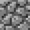

# 项目信息 打地鼠

> 2024/1/19

## 一. 项目信息

- **操作系统** : Windows

- **C语言环境** : mingw  gcc version 12.1.0 (MinGW-W64 x86_64-ucrt-posix-seh, built by Brecht Sanders)

- **编译选项** : 见文件夹中 CMakeLists 及 `src` 文件夹中 CMakeLists

- **使用的第三方库** : SDL2
  - 需要计算机已经配置好 SDL2 相关环境

## 二. 游戏信息

*强烈建议开声音玩 (没有逆天音效)*

### 1.**游戏规则:**

初始有10个地雷, 玩家有10点生命, 地鼠可能在任意的格子探头，若未及时对其进行用锤子进行攻击，玩家会掉一点血，血量归零则游戏失败。若未击中地鼠，玩家除掉血外，地鼠周边的格子(3\*3的范围，去掉地鼠所在格子共8个格子)隐含的地雷重新分布。若击中地鼠，地鼠会倒下，并根据地鼠种类实现相应功能. 当推测出某个格子有地雷后，可以用排雷工具清除地雷，地雷所在格子暴露；若对某格子使用排雷工具，但该格子并无地雷，则玩家掉血，该格子不会暴露。找到所有地雷则游戏胜利
暴露的格子可能会出现地鼠(此时击倒地鼠后不会产生地鼠对应效果)，但不再会出现地雷。
随着分数的增加, 地鼠冒头频率会变高。

- 未暴露方块 :                                                         已暴露方块:  

#### 地鼠种类 (出现概率递减):

- **探测地鼠 (普通地鼠)** : 击中后地鼠所在格子暴露，其周边的格子(3\*3的范围，去掉地鼠所在格子共8个格子)会显示数字，分别表示该格子周围的地雷数量(功能同扫雷);
- **混乱地鼠**: 击中后地鼠所在格子不暴露, 其周边格子(3*3的范围，去掉地鼠所在格子共8个格子)所含的地雷重新分配(已经暴

​       露的格子不会出现地雷);

- **不稳定地鼠**: 击中后地鼠所在格子暴露, 若地鼠所在格子存在地雷, 则地雷爆炸, 玩家失去5点生命 (爆炸的地雷也算作找到)

#### 计分规则

- 若游戏失败, 则找到地雷数量越多, 分数越高
- 若游戏胜利, 则所用事件越短, 分数越高

> 欢迎挑战我的最高记录()

### 2. 键位

- **鼠标左键:** 地鼠锤
- **鼠标右键:** 排雷工具

### 3. 游戏界面及功能介绍

窗口大小: 1280*760

#### 启动界面 

- 致敬某二字游戏

#### 菜单界面

- 界面中央`START` /`QUIT` 点击即可开始 / 退出游戏, 上下左右键可以切换 `>` 指向, 按`SPACE`/`ENTER` 执行对应操作
- 界面左侧`RECORDS` 点击显示近10条游戏记录, `RULES` 点击显示游戏背景故事及规则 (英文) (每页至少看3秒才能翻页)

#### 游戏界面

- 界面左侧: 显示玩家生命值; 已经找到的地雷数量及未找到的地雷数量; 本局游戏进行时间; 已经击倒的地鼠数; 随机到的bgm名字 
- 界面右侧: 显示地图; 地鼠冒头, 击倒地鼠, 损失生命值, 找到地雷都有对应音效提示; 找到的地雷会在方块上放置`小红旗`作为标识
- 按`ESC` 投降

#### 结算界面

- 再次致敬某二字游戏
- 若是最佳游戏记录, 则显示 `NEW RECORD`, 根据游戏 胜利/失败 对应选择显示 找到地雷数/所用时间; 
- 若不是最佳游戏记录, 则只显示最佳记录
- 点击 `BACK TO MENU` 返回菜单
